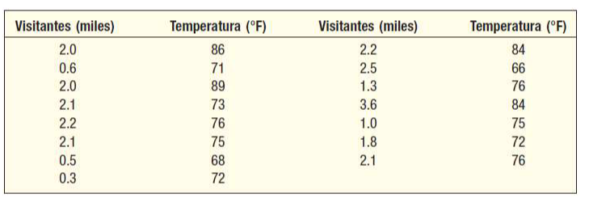

```{r setup, include=FALSE}
knitr::opts_chunk$set(echo = TRUE)
```

---

Contexto:

El director del Zoológico de Tampa estudia la relación entre el número de visitantes, en miles, y la temperatura alta, en grados Fahrenheit. Selecciona una muestra de 15 días y la información muestral recopilada se tabula a continuación:



De acuerdo a lo anterior, haga lo siguiente:

---

# Pregunta A: Regresion y diagrama de dispersion

a. Lea la base de datos, haga un análisis de regresión que prediga el número de visitantes mediante la temperatura y muestre el diagrama de dispersión junto con su recta de regresión

## Lectura de datos

```{r Leemos los datos}
library(readxl) #Llamamos a la liberia

data = read_excel("zoologico.xlsx", sheet="Hoja1")
data = data[-1]
data = as.data.frame(data)
data

```

## Regresion Lineal

- variable independiente : Temperatura en (°F)
- Variable dependiente : Visitantes en miles

```{r ecuación de regresión}

x = data$temperatura
y = data$visitantes

modelo = lm(y ~ x)

modelo$coefficients

```
## Grafico de dispersion

```{r dispercion}

plot(y ~ x, pch=20, col="red", xlab="temperatura", ylab="visitantes", main="Diagrama de dispersion")

abline(modelo,col="blue")
```

---

# Pregunta B: Linealidad e independencias

b. Verifique los supuestos de linealidad e independencia y diga si se aceptan o rechazan las
hipótesis nulas H0.


## Supuesto de Linealidad entre la variable dependiente y la independiente

Haremos uso de la función anova() que se basa en el estadístico F. Si el p-valor es menor a 0.05, se debe rechazar la hipótesis nula Ho, de que B1 = 0 (no existe una relación lineal entre X e Y), y en caso contrario se debe aceptar Ho.

```{r matriz correlacion}

anova(modelo)  # analysis of variance

```

### Interpretacion:

El p-valor (0.08702) es mayor a 0.05 => Se debe aceptar la hipótesis nula Ho de que B1 = 0. O sea. Es decir, no existe una relacion lineal entre X e Y.


## Supuesto de Independencia de los residuos

Si el p-valor (‘p-value’) es menor a 0.05, se debe rechazar la hipótesis nula Ho, de que NO existe autocorrelación entre los errores,lo que sugiere que hay evidencia de autocorrelación. y en caso contrario se debe aceptar Ho.  

```{r prueba durbin-watson, warning=FALSE}

library(lmtest)

dwtest(modelo)

```
### Interpretacion:

El p-valor (0.6579) es mayor que 0.05, lo que indica que no hay evidencia estadística suficiente para rechazar la hipótesis nula (H0) de que no hay autocorrelación entre los residuos. Por lo tanto, se sugiere que los residuos no están autocorrelacionados

---

# Pregunta C: Normalidad y Homocedasticidad

c. Verifique los supuestos de normalidad y homocedasticidad y diga si se aceptan o rechazan las
hipótesis nulas H0.

## Supuesto de Normalidad de los residuos

Hacemos uso de la función shapiro.test() que se basa en el estadistico Shapiro-Wilk sobre los residuos. Si el p-valor (‘p-value’) es menor a 0.05, se debe rechazar la hipótesis nula Ho de que los residuos se distribuyen normalmente, y en caso contrario se debe aceptar Ho. 


```{r prueba shapiro-wilk}

residuos = resid(modelo)

shapiro.test(x = residuos)

```
### Interpretación:

El p-value = 0.4652. Ya que el p-value es mayor que 0.05 entonces se acepta la Ho de que los residuos se distribuyen normalmente (lo que es bueno...)

### Grafico de ayuda

Tambien podemos verificar la normalidad de los residuos por medio de un gráfico Q-Q, en el que se deben encontrar alrededor de la recta.

```{r}
plot(modelo, 2)

```

## Supuesto de Varianza constante (homocedasticidad) de los residuos

Por ultimo, para probar la varianza constante (homocedasticidad) de los residuos hacemos uso de la función bptest() que se basa en el estadistico Breusch-Pagan sobre los residuos. Previo a ellos debemos instalar el paquete “lmtest" en caso de no tenerlo. 

Si el p-valor (‘p-value’) es menor a 0.05, se debe rechazar la hipótesis nula Ho, de que los residuos tienen varianza constante, y en caso contrario aceptar Ho. 

```{r prueba Breusch-Pagan}

library(lmtest)

bptest(modelo)

```

Ho: Los residuos tienen varianza constante 
H1: Los residuso no tienen varianza constante.

### Interpretacion:

El p-value = 0.302. Ya que es mayor que 0.05 entonces se acepta la Ho de que los residuos tienen varianza constante.


### Grafico de ayuda

Podemos hacer un gráfico de las raices cuadradas de los residuales estandarizados.


```{r}

plot(x = modelo, which = 3)

```


# Conclusiones finales

- Linealidad: No existe una relación lineal significativa entre la temperatura y el número de visitantes, ya que el p-valor (0.08702) es mayor que 0.05, lo que lleva a aceptar la hipótesis nula de que B1 = 0.
- Independencia de los residuos: Los residuos no están autocorrelacionados, ya que el p-valor (0.6579) es mayor que 0.05, lo que indica que no hay evidencia estadística suficiente para rechazar la hipótesis nula de que no hay autocorrelación entre los residuos. 
- Normalidad de los residuos: Los residuos se distribuyen normalmente, ya que el p-valor (0.4652) es mayor que 0.05, lo que lleva a aceptar la hipótesis nula de que los residuos se distribuyen normalmente.
- Homocedasticidad: Los residuos tienen varianza constante, ya que el p-valor (0.302) es mayor que 0.05, lo que lleva a aceptar la hipótesis nula de que los residuos tienen varianza constante.


En resumen, aunque no se encontró una relación lineal significativa entre la temperatura y el número de visitantes, los residuos del modelo cumplen con los supuestos de independencia, normalidad y homocedasticidad.

---